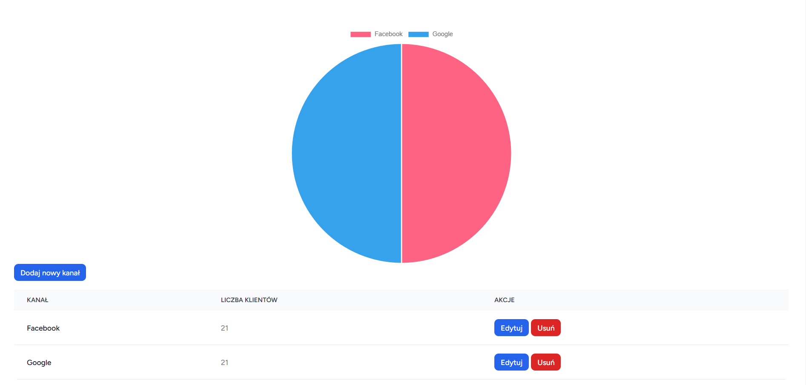

# Web Application for Managing Client Acquisition Channels with a Pie Chart Representation

---

## App preview image


---

## Pull request with all changes from the start for easier review
https://github.com/Wuczek/adsfoxrekrutacja/pull/8/files

---

## App can be accessed on /channels route.

---

## Features

1. **CRUD for Client Acquisition Channels**:
   - Adding new channels.
   - Editing existing channels.
   - Deleting channels.
   - Displaying a list of channels with their client counts.

2. **Pie Chart Visualization**:
   - Automatic generation of a pie chart based on the saved channels in the database.

3. **Testing**:
   - Comprehensive backend test coverage with PHPUnit.
   - Tests for the frontend using Jest and React Testing Library.

---

## Technologies

- **Backend**: Laravel, SQLite
- **Frontend**: React, TypeScript, Chart.js
- **Testing**:
  - PHPUnit (backend)
  - Jest (frontend)
  - React Testing Library (frontend)

---

## Installation

Clone the repo locally:

```sh
git clone https://github.com/Wuczek/adsfoxrekrutacja.git
cd adsfoxrekrutacja
```

Install PHP dependencies:

```sh
composer install
```

Install NPM dependencies:

```sh
npm install
```

Build assets:

```sh
npm run dev
```

Setup configuration:

```sh
cp .env.example .env
```

Generate application key:

```sh
php artisan key:generate
```

Create an SQLite database. You can also use another database (MySQL, Postgres), simply update your configuration accordingly.

```sh
touch database/database.sqlite
```

Run database migrations:

```sh
php artisan migrate
```

Run artisan server:

```sh
php artisan serve
```

## Running tests

To run the tests, run:

Backend:
```sh
php artisan test
```

Frontend:
```sh
npm run test
```
